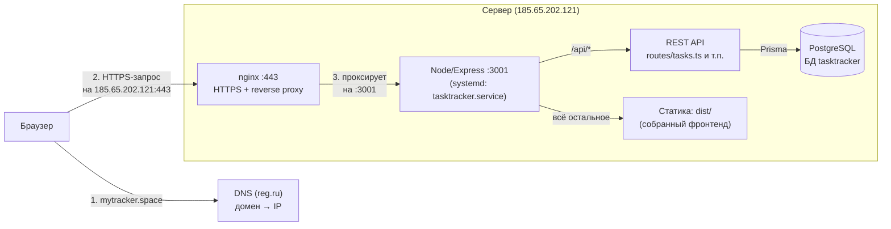

# PROJECT_BRAIN — начни отсюда

Если ты читаешь этот файл — не важно, человек ты или другая нейросеть —
у тебя, скорее всего, нет доступа к предыдущей переписке про этот
проект. Этот файл существует именно на такой случай: он самодостаточен —
после него не должно остаться вопроса "а что вообще происходит".

Дальше по тексту "ты" — это либо владелец проекта (если он сам это
читает после потери контекста), либо AI-ассистент, к которому владелец
обратился вместо Claude. Пиши/действуй соответственно.

## 0. Кто владелец и в каком он состоянии

Владелец проекта — **не программист**, учится разработке, строя этот
проект как свой первый реальный продукт. Он **не понимает, что
происходит в бэкенде** — это прямая цитата его собственного запроса, и
отдельно он явно переживает из-за того, что весь доступ к бэкенду шёл
только через AI-ассистента ("а что если я потеряю доступ к тебе").
Если он сам читает этот файл: не стесняйся, здесь всё объяснено на
пальцах, специально для этого, и раздел 4 отдельно даёт инструменты,
чтобы видеть код/базу/сервер напрямую, без AI вообще. Если это читает
другой AI: веди себя как терпеливый наставник, а не как бездушный
ассистент — объясняй термины простым языком сразу после употребления,
не сыпь жаргоном без разбора.

---

## 1. Что это за проект

**MyTracker** (домен `mytracker.space`) — личный трекер задач, целей (с
подцелями-milestones) и привычек. Одна страница "Today" (сегодняшние
задачи + прогресс), разделы Tasks / Goals / Habits / Calendar.

Смысл названия — намеренно личный, "мой трекер, мои планы" (по аналогии
с MyFitnessPal), а не generic "ещё один тудушник".

Это одновременно: (а) реальный личный инструмент, которым владелец
собирается пользоваться, и (б) учебный проект — отсюда стиль работы:
всё объясняется, ведётся подробная документация, ничего не делается
"по-быстрому и без объяснений".

---

## 2. Технологический стек — что и почему

| Слой | Технология | Почему |
|---|---|---|
| Фронтенд | React + TypeScript + Vite | Стандарт индустрии, много ресурсов для обучения |
| Архитектура фронта | Feature-Sliced Design (FSD) v2.1 | Чёткие правила, куда класть код — не даёт превратиться в кашу по мере роста |
| Бэкенд | Node.js + TypeScript + Express 5 | Один язык (TS) на весь стек — типы переиспользуются без дублирования |
| ORM | Prisma | Пишешь `db.task.findMany()` вместо ручного SQL |
| База данных | PostgreSQL | Стандартная реляционная БД, нативно установлена на сервере (не в Docker) |
| Деплой | Свой VPS (HipHosting), без управляемых платформ (не Vercel/Railway) | Осознанный выбор владельца: "работает на наших мощностях, без посредников" |
| Reverse proxy | nginx | Принимает интернет-трафик, передаёт на Node |
| HTTPS | certbot (Let's Encrypt), бесплатно, автопродление | — |
| CI/CD | GitHub Actions | Автодеплой при пуше в `main` |

**Подробности и обоснование каждого решения** — `docs/ARCHITECTURE.md`
(технические компромиссы) и `docs/DEPLOYMENT.md` (точная инфраструктура
продакшена, с конфигами дословно).

---

## 3. Как это всё работает вместе — по шагам

Это специально написано подробно, потому что владелец прямо попросил
объяснить именно это.

### 3.1 Что происходит, когда открываешь сайт



1. Браузер обращается к `mytracker.space` — DNS-запись (настроена на
   reg.ru) говорит "это IP `185.65.202.121`"
2. На этом IP на порту 443 (HTTPS) слушает **nginx** — единственная
   программа, которая вообще принимает интернет-трафик напрямую
3. nginx расшифровывает HTTPS (у него есть сертификат от Let's Encrypt)
   и перенаправляет запрос дальше, на `127.0.0.1:3001` — это уже
   локальный адрес **внутри** сервера, наружу не смотрит
4. На порту 3001 работает наш **Node.js/Express**-процесс (управляется
   через `systemd`, юнит `tasktracker.service` — это то, что следит,
   чтобы процесс не падал и перезапускался сам)
5. Express смотрит на путь запроса:
   - Если путь начинается с `/api/` → это запрос к нашему REST API
     (см. 3.2)
   - Если нет → Express отдаёт собранный фронтенд (файлы из `dist/`,
     результат `npm run build`) — то есть HTML/CSS/JS, которые дальше
     выполняются уже в браузере пользователя
6. Дальше вся логика интерфейса (клики, формы, drag-and-drop) —
   выполняется в браузере, на JS/TS-коде из `src/`. Когда нужно
   прочитать/сохранить данные, браузер сам обращается на `/api/...`

### 3.2 Как фронтенд и бэкенд обмениваются данными

- Всего два вида запросов на каждую сущность (задачи/цели/привычки):
  - `GET /api/tasks` → "пришли мне все задачи" → сервер читает из
    PostgreSQL через Prisma → отдаёт JSON-массив
  - `PUT /api/tasks` → "вот весь актуальный список задач, сохрани его
    таким" → сервер **удаляет всё, что было, и создаёт заново** из
    присланного массива (это осознанное упрощение, не баг — подробно
    объяснено в `docs/ARCHITECTURE.md`, раздел про REST API)
- Никаких отдельных `POST`/`DELETE`/`PATCH` на одну задачу — фронтенд
  всегда работает "вот весь список" целиком. Это работает благодаря
  паттерну `Repository<T>` — единому интерфейсу `list()`/`save(items)`,
  который одинаково выглядит что для `localStorage` (как было раньше),
  что для настоящего сервера (как сейчас) — сам компонент формы или
  провайдер вообще не знает и не должен знать, откуда берутся данные

### 3.3 Локальная разработка vs продакшен — одна и та же схема

- **В деве** (`npm run dev`): Vite сам поднимает dev-сервер на порту
  5173, и по правилу из `vite.config.ts` (`server.proxy`) любой запрос
  на `/api/*` он сам перенаправляет на `localhost:3001`, где параллельно
  крутится бэкенд (`npm run dev` внутри `server/`)
- **В проде**: nginx делает буквально то же самое — принимает всё и
  отдаёт на 3001-й порт
- Именно поэтому в коде фронтенда `VITE_API_URL` всегда равен
  `/api` (относительный путь) — что в деве, что в проде, менять ничего
  не нужно

### 3.4 Что такое эти твои "агенты" в `.claude/`

Это не часть приложения — это инструкции для Claude Code (AI-ассистента
в терминале), специфичные под этот проект:
- `project-guide` — отвечает на вопросы "почему это сделано так"
- `qa-tester` — тестирует функциональность через настоящий браузер
- `docs-writer` — пишет/обновляет документацию в `docs/requirements/`
  вместе с каждым изменением кода

Если владелец переключится на другой AI-инструмент — эти файлы ему не
нужны сами по себе, но **знание, которое они используют** (весь `docs/`)
переносимо на любой AI, включая тебя, кто бы ты ни был.

---

## 4. Как увидеть всё самому, без ИИ

Ключевая мысль: "чёрный ящик" бэкенда на самом деле состоит из трёх
частей, которые просматриваются независимо друг от друга и не требуют
никакого AI-ассистента — ни меня, ни кого-либо ещё.

### 4.1 Код — и бэкенда, и фронтенда

Это просто текстовые файлы. Открываются любым редактором, например
**VS Code** (бесплатный, стандарт индустрии).

Дополнительно — расширение **"Remote - SSH"** (от Microsoft, ставится
через маркетплейс VS Code) позволяет открыть в VS Code не локальную
копию, а сам сервер напрямую: `Cmd+Shift+P` → "Remote-SSH: Connect to
Host" → `deploy@185.65.202.121`. После этого VS Code показывает
`/var/www/tasktracker` на сервере как обычную папку — файловое дерево,
открытие файлов, встроенный терминал, — вообще без необходимости
что-либо спрашивать у AI.

### 4.2 Данные в базе — Prisma Studio (уже есть в проекте)

`npx prisma studio`, команда уже есть в `server/package.json` как
`npm run prisma:studio`. Открывает визуальный GUI в браузере на
`localhost:5555` — все таблицы, можно листать, фильтровать, и даже
редактировать значения руками, без единой строчки SQL.

**Для локальной базы** (та, что используется при `npm run dev`):
```bash
cd server
npx prisma studio
```
Само откроет браузер на `localhost:5555`.

**Для продовой базы на VPS** — PostgreSQL там сознательно не открыт
наружу (ради безопасности, см. `docs/DEPLOYMENT.md`, раздел про
firewall), поэтому нужен SSH-туннель — один порт с сервера "пробрасывается"
на свой компьютер:
```bash
ssh -L 5555:localhost:5555 deploy@185.65.202.121
# дальше, уже внутри этой SSH-сессии:
cd /var/www/tasktracker/server
npx prisma studio --port 5555 --browser none
```
Пока эта SSH-сессия открыта — на своём компьютере открой
`http://localhost:5555` в браузере: это будет живая продовая база.
Закрыть — `Ctrl+C` в SSH-сессии (и не забыть, что пока она открыта,
кто угодно с доступом к твоему компьютеру тоже мог бы туда зайти —
не оставлять запущенным без необходимости).

Альтернатива для постоянной, более удобной работы — десктопное
приложение вроде **TablePlus** или **Postico** (для Mac): тоже
подключается через тот же SSH-туннель к порту PostgreSQL (5432), но
не нужно каждый раз руками запускать Prisma Studio.

### 4.3 Сам сервер — логи и статус процесса

```bash
ssh deploy@185.65.202.121
sudo systemctl status tasktracker      # жив ли процесс сейчас
sudo journalctl -u tasktracker -f      # логи в реальном времени (Ctrl+C — выйти)
```

### 4.4 Диаграмма архитектуры

Диаграмма в разделе 3.1 выше — это **Mermaid**-диаграмма, обычный текст
внутри markdown-файла. GitHub отрисовывает её сам в виде настоящей
картинки, если открыть этот файл на github.com (или в VS Code с
включённым просмотром markdown) — специальный инструмент для этого не
нужен.

---

## 5. Файловая карта — что где лежит

```
TaskTrackerNew-main/
├── PROJECT_BRAIN.md          ← ты здесь
├── LEARNING.md                глоссарий терминов + журнал решений
│                               (хронологический, "что разбирали когда")
├── src/                       фронтенд (React, FSD-слои: app/pages/
│                               widgets/features/entities/shared)
├── server/                    бэкенд (Express + Prisma)
│   ├── prisma/schema.prisma   модели данных (Task/Goal/Habit)
│   └── src/routes/            GET/PUT обработчики на каждую сущность
├── docs/
│   ├── ARCHITECTURE.md        ПОЧЕМУ технически всё устроено именно так
│   ├── DEPLOYMENT.md          ТОЧНАЯ инфраструктура прода (конфиги дословно)
│   ├── REPO_STRUCTURE.md      что за что отвечает в самом репозитории
│   ├── ROADMAP.md             известные слабые места + план на будущее
│   │                           (гранулярный API, логи, Docker)
│   └── requirements/          ЧТО именно делает каждая фича, по пунктам
│       ├── STYLE_GUIDE.md     как писать эти доки
│       └── 01. Tasks/         пример — остальные фичи дополняются по ходу
├── .claude/
│   ├── agents/                см. 3.4 выше
│   └── skills/coding-mentor/  как AI должен объяснять код этому владельцу
└── .github/workflows/deploy.yml   автодеплой при пуше в main
```

**Порядок чтения, если нужно разобраться с нуля**: этот файл → `docs/ARCHITECTURE.md`
→ `docs/DEPLOYMENT.md` → конкретный файл в `docs/requirements/` под ту
фичу, с которой работаешь.

---

## 6. Продакшен-инфраструктура — сводка

(Полные подробности с конфигами дословно — `docs/DEPLOYMENT.md`.)

- **VPS**: HipHosting, IP `185.65.202.121`, Ubuntu 24.04
- **Домен**: `mytracker.space` + `www.mytracker.space`, куплен на reg.ru,
  автопродление домена включено (требует привязанной карты у владельца)
- **HTTPS**: Let's Encrypt через certbot, автопродление сертификата —
  автоматическое (systemd-таймер certbot)
- **Доступ**: только по SSH-ключу (пароль и root-вход отключены);
  рабочий пользователь `deploy`
- **База данных**: PostgreSQL, БД `tasktracker`, пользователь `tasktracker`,
  пароль лежит только на сервере в `/home/deploy/db_url.txt`
- **Бэкапы БД**: ежедневно в 03:00 (cron), `pg_dump` →
  `/home/deploy/backups/`, хранится последние 14 штук — см. раздел 7.4
  ниже про то, чем это НЕ защищает
- **CI/CD**: пуш в `main` → GitHub Actions по SSH (отдельный deploy-ключ,
  не личный) → `git pull` + пересборка + `prisma migrate deploy` +
  рестарт `systemd`-сервиса, проверено рабочим вживую (2026-09-16)

---

## 7. Playbook: что делать, если что-то потеряно

Это главный раздел, ради которого владелец попросил написать этот файл.
Для каждого сценария: что произошло, что НЕ потеряно (и почему), что
делать по шагам.

### 7.1 Потерян личный SSH-ключ (не можешь зайти на VPS как раньше)

**Что не потеряно**: сам сервер жив, код в GitHub, GitHub Actions
по-прежнему может задеплоить через свой отдельный CI-ключ (см. 6) — но
это не даёт тебе личный доступ по SSH.

**Что делать**:
1. Зайти в панель HipHosting (веб-консоль провайдера обычно даёт доступ
   к серверу даже без SSH — через браузерный терминал/VNC)
2. Через веб-консоль зайти как `deploy` (или через root, если доступен),
   сгенерировать новый SSH-ключ на своём новом устройстве:
   `ssh-keygen -t ed25519`
3. Добавить новый публичный ключ в `/home/deploy/.ssh/authorized_keys`
4. Убедиться, что новый ключ работает (`ssh -i новый_ключ deploy@185.65.202.121`),
   и только после этого удалить строку со старым ключом из
   `authorized_keys`, если он скомпрометирован

### 7.2 VPS полностью потерян/сломан (провайдер удалил, диск умер и т.п.)

**Что не потеряно**: весь код — в GitHub (`github.com/Elf1movv/TaskTrackerNew`);
вся инфраструктура **дословно** описана в `docs/DEPLOYMENT.md` (все
команды установки, весь конфиг nginx, весь systemd-юнит — можно
буквально скопировать и выполнить заново); последний бэкап БД — если
успел скачать его с сервера до потери (см. 7.4, это важное "если").

**Что делать**:
1. Арендовать новый VPS (тот же HipHosting или любой другой — инструкция
   не завязана на конкретного провайдера)
2. Пройти `docs/DEPLOYMENT.md` заново от начала до конца — установка
   Node/PostgreSQL/nginx/certbot, создание БД, клонирование репозитория,
   systemd-юнит, nginx-конфиг
3. Восстановить БД из последнего скачанного бэкапа (команда — в 7.4)
4. Поменять DNS A-запись на reg.ru на IP нового сервера
5. Заново запустить `certbot --nginx -d mytracker.space -d www.mytracker.space`

### 7.3 Домен потерян (не продлили вовремя, или увели)

**Что делать**:
1. Если истёк недавно — зайти на reg.ru, там обычно есть период
   "выкупа" (redemption period), можно продлить с доплатой
2. Если домен уже нельзя вернуть — купить новый на любом регистраторе,
   обновить DNS A-запись на IP сервера (`185.65.202.121` или новый, если
   сервер тоже менялся), обновить `server_name` в конфиге nginx
   (`/etc/nginx/sites-available/tasktracker`), заново прогнать certbot
   с новым доменом

**Профилактика**: автопродление домена уже включено на reg.ru — убедись,
что к аккаунту привязана рабочая карта (это отдельно проверялось при
покупке и на тот момент карты не было).

### 7.4 Данные в базе потеряны/испорчены (случайно снесли, плохая миграция)

**Что есть**: ежедневный автоматический бэкап на самом сервере
(`/home/deploy/backups/`, cron в 03:00, хранится 14 последних).

**Важное ограничение**: эти бэкапы лежат **на том же сервере**, что и
сама база. Если случится сценарий 7.2 (весь VPS потерян) — бэкапы на
нём тоже пропадут вместе с ним. Это НЕ защита от потери сервера
целиком, только от "случайно снёс данные, а сервер жив".

**Восстановить бэкап на живом сервере**:
```bash
ssh deploy@185.65.202.121
gunzip -c /home/deploy/backups/tasktracker_<дата>.sql.gz | \
  psql "$(grep DATABASE_URL /var/www/tasktracker/server/.env | cut -d= -f2- | tr -d '"')"
```

**Чтобы защититься и от потери сервера целиком** — периодически
скачивать свежий бэкап себе на компьютер (раз в 1-2 недели за глаза
достаточно для личного проекта):
```bash
scp deploy@185.65.202.121:/home/deploy/backups/tasktracker_*.sql.gz ~/tasktracker-backups/
```
Это единственный шаг во всей системе бэкапов, который не автоматизирован
и зависит от того, что кто-то (владелец) не забудет его периодически
выполнять. Стоит либо завести себе напоминание, либо (в будущем) сделать
отдельную автоматизацию загрузки бэкапов во внешнее хранилище — на
момент написания этого файла такая автоматизация ещё не сделана.

### 7.5 Потерян доступ к Claude / к этой переписке

Ты уже это читаешь — значит, план сработал. Дальше: раздел 5 (файловая
карта) → раздел 4 (как всё увидеть самому) → читай `docs/ARCHITECTURE.md`
и `docs/DEPLOYMENT.md` → всё остальное знание там.

### 7.6 Потерян доступ к аккаунту GitHub

**Что не потеряно**: последняя выкачанная копия кода есть локально на
компьютере владельца (там же, где велась разработка) и на самом VPS
(`/var/www/tasktracker`, там уже стоит рабочая версия).

**Что делать**:
1. Попробовать восстановить доступ через процедуру восстановления
   GitHub (привязанная почта/телефон)
2. Если аккаунт не восстановить — создать новый репозиторий на новом
   аккаунте, запушить туда код из последней рабочей копии (локальной или
   с самого VPS через `git bundle`/просто копию файлов, если `.git`
   истории на VPS для этого достаточно), обновить `origin` в
   `.github/workflows/deploy.yml`-процессе (GitHub Secrets — заново, они
   привязаны к репозиторию, не переносятся автоматически)

### 7.7 Потерян доступ к аккаунту HipHosting (провайдер VPS)

**Что делать**: восстановление через поддержку провайдера — как с любым
аккаунтом. Если невозможно — сервер де-факто эквивалентен сценарию 7.2
(потерян VPS), просто с другим провайдером в самом начале
`docs/DEPLOYMENT.md`. Сама инструкция не завязана на HipHosting
специально, кроме способа первоначальной покупки/веб-консоли.

---

## 8. Чек-лист регулярной гигиены (чтобы не дошло до раздела 7)

- [ ] Автопродление домена на reg.ru — карта привязана и рабочая
- [ ] SSL-сертификат — автопродление уже настроено certbot'ом, ничего
      делать не нужно, но раз в несколько месяцев не помешает проверить
      `sudo certbot certificates` на сервере
- [ ] Раз в 1-2 недели — скачивать свежий бэкап БД себе на компьютер
      (команда в 7.4) — единственный не автоматизированный шаг
- [ ] Личный SSH-ключ — храни его резервную копию не только на одном
      устройстве (например, в менеджере паролей)
- [ ] Раз в несколько месяцев — реально попробовать один из сценариев
      восстановления (хотя бы 7.1) на практике, а не только полагаться,
      что инструкция сработает "в теории"
