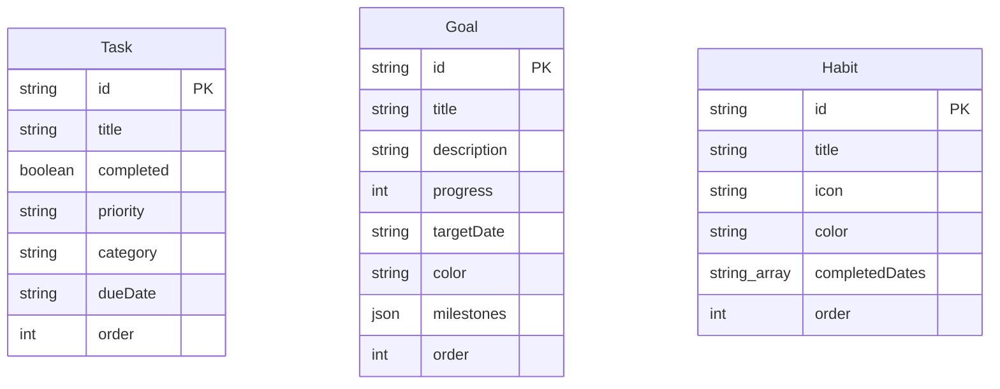

# Архитектура проекта

Этот файл — техническое описание того, как устроено приложение и почему
именно так. Он существует отдельно от `LEARNING.md` (там — обучающий
глоссарий и журнал решений в стиле "что мы разбирали и когда"): этот файл —
справочник по системе целиком, для быстрого поиска ответа на вопрос "как
это устроено" без необходимости перечитывать историю разработки.

Если этот файл разошёлся с реальным кодом (например, описан паттерн,
которого уже нет) — значит, документация устарела и её нужно поправить,
а не доверять ей вслепую.

## Что это за приложение

Личный трекер задач, целей (с вложенными milestones) и привычек. Одна
страница "Today" (сегодняшние задачи + прогресс), отдельные разделы Tasks /
Goals / Habits / Calendar.

## Стек

- **Фронтенд**: React + TypeScript + Vite, архитектура — Feature-Sliced
  Design (FSD) v2.1
- **Бэкенд**: Node.js + TypeScript + Express 5 + Prisma ORM
- **База данных**: PostgreSQL
- **Деплой**: свой VPS (см. `docs/DEPLOYMENT.md`), без управляемых
  платформ (Vercel/Railway и т.п.) — осознанный выбор, "работает на наших
  мощностях, без посредников"

## Frontend: Feature-Sliced Design

Слои (от общего к частному): `app` → `pages` → `widgets` → `features` →
`entities` → `shared`. Слой выше может импортировать только из слоёв ниже
себя, никогда наоборот, и **никогда напрямую из соседнего слайса того же
слоя** (например, `features/habit-card` не может импортировать из
`features/delete-habit` — это разные фичи одного слоя).

Когда двум фичам одного слоя нужно скомпоноваться вместе (например,
показать карточку привычки + кнопки редактирования/удаления рядом) —
это делается на уровне `widgets`, который имеет право импортировать из
нескольких фич сразу. Пример: `widgets/habit-tracker-grid` собирает вместе
`features/habit-card` + `features/edit-habit` + `features/delete-habit`.

Соблюдение архитектуры проверяется линтером **Steiger**
(`steiger.config.js`) — см. `docs/../project_steiger_fsd_linter` в памяти
проекта. Два правила намеренно понижены до `warn`:
`fsd/insignificant-slice` и `fsd/segments-by-purpose` (для
`app/providers`) — осознанный компромисс на раннем этапе роста проекта.

### Repository<T> — абстракция хранения данных

Ключевой паттерн, который позволил заменить `localStorage` на настоящий
бэкенд **без единого изменения** в коде фич/сущностей/страниц:

```ts
interface Repository<T> {
  list(): Promise<T[]>
  save(items: T[]): Promise<void>
}
```

`entities/task/api/taskRepository.ts` (и аналогично `goal`, `habit`)
знает только про этот интерфейс. Раньше он создавался через
`createLocalStorageRepository`, теперь — через `createRestRepository`.
Все провайдеры (`TaskProvider`, `GoalProvider`, `HabitProvider`) и вся
остальная кодовая база работают через один и тот же контракт и вообще не
знают, откуда на самом деле берутся данные.

### Drag-and-drop: критичный gotcha с callback ref

Все хуки drag-and-drop (`useDragReorder`, `useDragItem`, `useDropTarget` в
`shared/lib/dnd/`) **обязаны** оборачивать возвращаемый ref-callback в
`useCallback`. Если этого не сделать, React будет отсоединять и заново
присоединять DOM-узел на каждый рендер — драг ломается прямо посреди
жеста (внешне выглядит как "текст просто выделяется" или "элемент
подхватывается, но при отпускании прыгает назад").

Это же правило касается любых обработчиков, которые передаются в эти
хуки — если создавать их инлайн внутри `.map()` без `useCallback`, они
тоже будут нестабильны на каждый рендер. Смотри как пример
`widgets/calendar-grid/ui/components/CalendarDayCell.tsx` — он сам
собирает свой стабильный обработчик через `useCallback`, а не получает
готовый инлайн-замыкание из родителя.

**Если где-то в будущем drag-and-drop снова "не работает через раз" —
первым делом проверяй именно это.**

## Backend

### REST API: замена всей коллекции целиком, а не гранулярный CRUD

Роуты (`server/src/routes/tasks.ts`, `goals.ts`, `habits.ts`) — по два на
сущность:
- `GET /` — вернуть весь список
- `PUT /` — заменить весь список целиком (транзакция: `deleteMany({})` +
  `createMany`)

Это сознательный компромисс ради простоты: фронтенд и так был построен
вокруг `Repository<T>.save(items)` ("вот весь список, сохрани его"), а не
вокруг отдельных `POST /tasks/:id`, `PATCH /tasks/:id` и т.д. Поэтому
переход на бэкенд не потребовал переписывать фронтенд.

**Известное ограничение**: если два устройства редактируют данные
одновременно, последний `PUT` побеждает и затирает изменения другого
устройства целиком (нет merge, нет конфликт-резолюции). Это осознанно
отложено — станет важной проблемой только тогда, когда реально появится
синхронизация между несколькими активными устройствами одновременно.
Если до этого дойдёт — нужно будет переходить на гранулярные endpoints
(`POST`/`PATCH`/`DELETE` по отдельности) или добавлять версионирование
записей.

### Модель данных (`server/prisma/schema.prisma`)



Три независимые таблицы — **без внешних ключей друг на друга**, это не
случайность: сущности приложения сейчас никак не связаны между собой
(задача не привязана к цели, привычка не привязана ни к чему). Если
появится, например, "привязать задачу к цели" — тогда в `Task`
понадобится `goalId` со внешним ключом на `Goal.id`, и эту диаграмму
нужно будет обновить.

Три модели: `Task`, `Goal`, `Habit`. У каждой есть `order` (для
сохранения порядка после drag-and-drop) и `userId` (nullable, сейчас
нигде не используется — оставлено заранее, чтобы при добавлении логина
не пришлось болезненно мигрировать существующие строки).

`Goal.milestones` хранится JSON-колонкой, а не отдельной таблицей — чтобы
не усложнять сверх уровня, который уже был у `Task`. Можно
нормализовать в отдельную таблицу позже, если понадобится сложная
работа с milestones напрямую через SQL.

### Single-origin в продакшене

`server/src/index.ts` в продакшене не только отвечает на `/api/*`, но и
раздаёт собранный фронтенд (`express.static` + SPA fallback на
`index.html` для любых остальных путей). Один процесс, один порт, один
origin — это убирает необходимость в CORS-настройке для продакшена и
упрощает деплой (одна точка входа вместо двух отдельных серверов).

В деве всё точно так же работает благодаря `vite.config.ts` → `server.proxy`
(`/api` проксируется на `localhost:3001`), поэтому `VITE_API_URL=/api`
(относительный путь) — единственное значение, которое вообще когда-либо
нужно, и в деве, и в проде.

## Философия проверки изменений

Прохождение тайпчекера/линтера — необходимое, но не достаточное условие
"работает". Пример: баг с нестабильными callback ref проходил
тайпчекинг без единой ошибки, но реально ломал drag-and-drop в браузере.
Правило: перед тем как считать функциональность готовой, проверять её
реальным взаимодействием (настоящий клик/драг мышью, реальный проход
через API curl'ом, реальная проверка данных в базе), а не только
статическим анализом.

## Известные ограничения / технический долг

- Нет авторизации/логина — `userId` в схеме есть, но не используется
- Нет гранулярного REST API — см. раздел выше про whole-collection PUT
- Нет обработки конфликтов при одновременном редактировании с двух
  устройств
- Один большой JS-бандл на фронтенде (626 KB), Vite предупреждает про
  code-splitting — не критично при текущем размере приложения, но
  стоит учитывать при значительном росте функциональности
